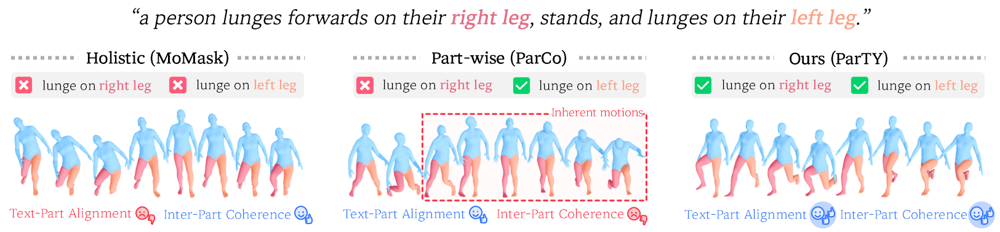
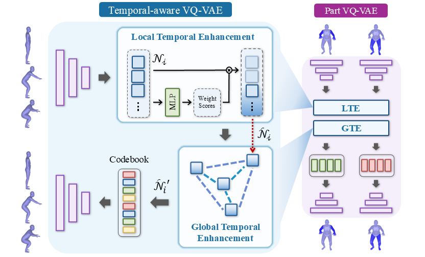
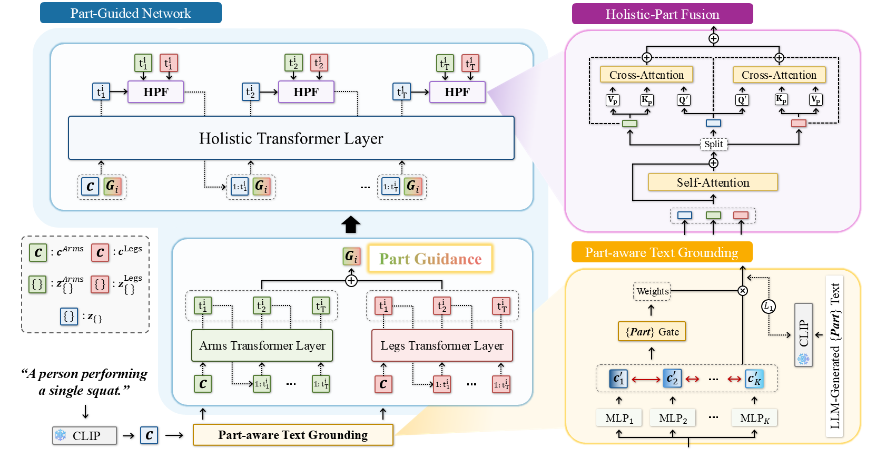
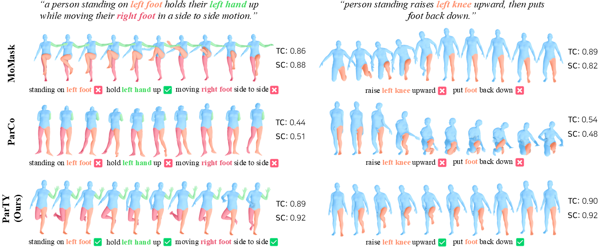

---
layout: project_page
permalink: /

title: "A Semantically Disentangled Unified Model for Multi-category 3D Anomaly Detection"
affiliations:
    Kyung Hee University
arxiv: https://arxiv.org/pdf/2603.09611 # change to CVF
paper: https://arxiv.org/pdf/2603.09611 # change to CVF
# code: https://github.com/VisualScienceLab-KHU/ParTY # change to CVF
---

  

    <h2>Abstract</h2>
    

      Text-to-motion synthesis aims to generate natural and expressive human motions from textual descriptions. While existing approaches primarily focus on generating holistic motions from text descriptions, they struggle to accurately reflect actions involving specific body parts. Recent part-wise motion generation methods attempt to resolve this but face two critical limitations: (i) they lack explicit mechanisms for aligning textual semantics with individual body parts, and (ii) they often generate incoherent full-body motions due to integrating independently generated part motions. To overcome these issues and resolve the fundamental trade-off in existing methods, we propose <b>ParTY</b>, a novel framework that enhances part expressiveness while generating coherent full-body motions. ParTY comprises: <b>(1) Part-Guided Network</b>, which first generates part motions to obtain part guidance, then uses it to generate holistic motions; <b>(2) Part-aware Text Grounding</b>, which diversely transforms text embeddings and appropriately aligns them with each body part; and <b>(3) Holistic-Part Fusion</b>, which adaptively fuses holistic motions and part motions. Extensive experiments, including <b>part-level</b> and <b>coherence-level</b> evaluations, demonstrate that ParTY achieves substantial improvements over previous methods.
    

  

<h2 style="text-align: center;">Architecture</h2>

### Stage 1. Temporal-aware Vector Quantization

  

    
  

  

    <b>Temporal-aware VQ-VAE</b> reduces temporal information loss caused by fixed-window quantization. It first applies <b>Local Temporal Enhancement (LTE)</b>, where an MLP-based weighted sum preserves important short-term motion cues within each window. It then applies <b>Global Temporal Enhancement (GTE)</b>, where a GCN updates group-level features to capture long-range temporal dependencies. The enhanced features are mapped to codebook tokens, and the same design is used for both full-body and part (arms/legs) streams to provide stable motion tokens for next stage.
  

### Stage 2. Part-Guided Motion Synthesis

  

Next, we first applies <b>Part-aware Text Grounding (PTG)</b>: a CLIP text embedding is transformed by multiple part-specific MLPs, and a part gate selects the most suitable embedding for each body part. To keep both diversity and semantic consistency, PTG is trained with a contrastive diversity objective and an auxiliary part-text alignment loss.
Then the <b>Part-Guided Network</b> generates arm/leg tokens autoregressively and fuses them into <b>Part Guidance</b> over short cycles. The holistic transformer uses this guidance to generate full-body tokens, instead of predicting holistic motion alone.
During generation, <b>Holistic-Part Fusion (HPF)</b> continuously injects part tokens into the holistic stream via attention, improving whole-body coordination while preserving fine-grained part expressiveness.

 

<h2 style="text-align: center;">Visualizations</h2>

  

**Part-level evaluation.** The qualitative analysis shows that ParTY better matches fine-grained part instructions (e.g., specific arm/leg actions) than both holistic (MoMask) and prior part-wise baseline (ParCo). This observation is consistent with the part-level metrics: ParTY improves part-wise text-motion alignment and motion quality for both arms and legs, indicating that part semantics are preserved during generation rather than diluted in full-body synthesis.

**Coherence-level evaluation.** We also highlights that strong part control alone is insufficient if global coordination collapses. Prior part-wise generation can show artifacts such as neck distortion or mismatched upper/lower body orientation, which lowers temporal and spatial consistency. ParTY maintains synchronized full-body dynamics while executing part-specific motions, reflected by stronger <b>Temporal Coherence (TC)</b> and <b>Spatial Coherence (SC)</b> scores and visually stable poses across frames.

 

## BibTeX
